<h2>TensorFlow-FlexUNet-Image-Segmentation-Aphasia-Recovery-Cohort-MRI (2025/09/27)</h2>
Toshiyuki Arai 
Software Laboratory antillia.com  
This is the first experiment of Image Segmentation for <b>Aphasia Recovery Cohort (ARC ) MRI</b>, based on 
our <a href="./src/TensorFlowFlexUNet.py">TensorFlowFlexUNet</a>
 (<b>TensorFlow Flexible UNet Image Segmentation Model for Multiclass</b>)
 and a 512x512 pixels 
<a href="https://drive.google.com/file/d/1x7d2_QQL-whgIFmnbZdYcNBvu7XFHCLT/view?usp=sharing">
ARC-PNG-ImageMask-Dataset.zip</a>
, which was derived by us from <b>NIfTI</b> dataset of 
<a href="https://github.com/neurolabusc/AphasiaRecoveryCohortDemo">
<b>AphasiaRecoveryCohortDemo</b></a>
 On the <b>ARC</b> dataset, please refer to OpenNEURO 
<a href="https://openneuro.org/datasets/ds004884/versions/1.0.2"><b>Aphasia Recovery Cohort (ARC) Dataset</b></a>
 
 
As demonstrated in <a href="https://github.com/sarah-antillia/TensorFlow-FlexUNet-Image-Segmentation-STARE-Retinal-Vessel">
TensorFlow-FlexUNet-Image-Segmentation-STARE-Retinal-Vessel</a>,
 our Multiclass TensorFlowFlexUNet, which uses categorized masks, can also be applied to 
single-class image segmentation models. 
This is because it inherently treats the background as one category and your single-class mask data as 
a second category. In essence, your single-class segmentation model will operate with two categorized classes within our Multiclass UNet framework.
  

<b>Actual Image Segmentation for Images of 512x512 pixels</b> 
As shown below, the inferred masks predicted by our segmentation model trained on the 
our dataset appear similar to the ground truth masks. 
 
<table>
<tr>
<th>Input: image</th>
<th>Mask (ground_truth)</th>
<th>Prediction: inferred_mask</th>
</tr>
<tr>
<td>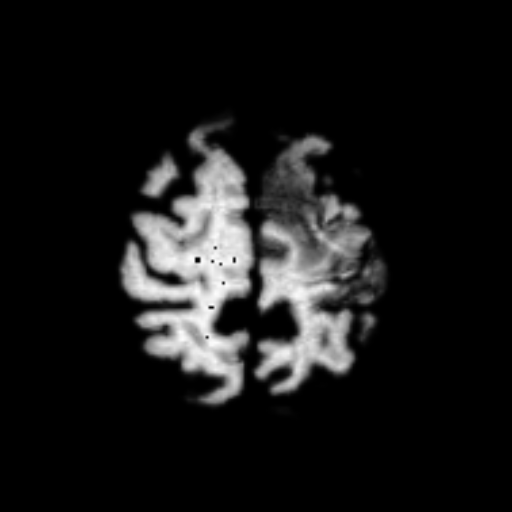</td>
<td></td>
<td></td>
</tr>

<tr>
<td>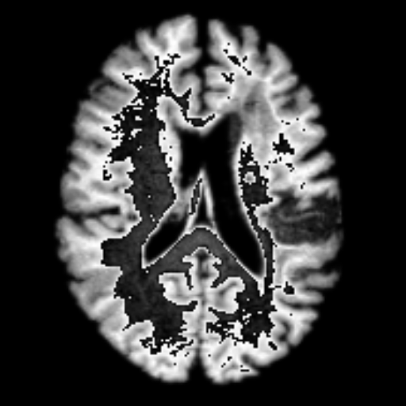</td>
<td></td>
<td></td>
</tr>

<tr>
<td>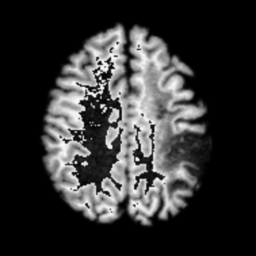</td>
<td></td>
<td></td>
</tr>
</table>

 

<h3>1. Dataset Citation</h3>
The dataset used here was obtained from 
  
<a href="https://github.com/neurolabusc/AphasiaRecoveryCohortDemo">
<b>https://github.com/neurolabusc/AphasiaRecoveryCohortDemo</b></a>
 
 
<b>About</b> 
This repository includes scripts to process and analyze images from the original 228 individuals in 
the Aphasia Recovery Cohort (ARC) Dataset, as well as the resulting images derived from the processing. 
The goal of this repository is to provide a minimal starting point for analyzing the ARC. 
This chronic dataset complements the acute data from the Stroke Outcome Optimization Project (SOOP).  
This educational resource illustrates how to process clinical datasets stored in the BIDS format. 
Our hope is that more sophisticated methods can improve clinical lesion mapping, spatial processing and 
prediction. The current repository reflects the first tranche of data, with upcoming (hidden) 
releases allowing fair competitions future refinements.

 
 
On this dataset, please see also OpenNUERO website 
<a href="https://openneuro.org/datasets/ds004884/versions/1.0.2">Aphasia Recovery Cohort (ARC) Dataset</a>
  
<b>Dataset DOI</b> 
doi:10.18112/openneuro.ds004884.v1.0.2 
 
<b>License</b> 
<a href="https://creativecommons.org/public-domain/cc0/">
CC0</a>
 
 

<b>Citation:</b> 
Makayla Gibson, Roger Newman-Norlund, Leonardo Bonilha, Julius Fridriksson, Gregory Hickok,  
Argye E. Hillis, Dirk-Bart den Ouden, and Chris Rorden (2024).  
Aphasia Recovery Cohort (ARC) Dataset. OpenNeuro. [Dataset] doi: doi:10.18112/openneuro.ds004884.v1.0.2
 
 
<h3>
<a id="2">
2 ARC ImageMask Dataset
</a>
</h3>
<h4>2.1 Download ARC-PNG-ImageMask-Dataset</h4>
 If you would like to train this ARC Segmentation model by yourself,
 please download  our dataset <a href="https://drive.google.com/file/d/1x7d2_QQL-whgIFmnbZdYcNBvu7XFHCLT/view?usp=sharing">
 ARC-PNG-ImageMask-Dataset.zip (2.5GB) </a> on the google drive
, expand the downloaded and put it under <b>./dataset</b> folder to be. 
<pre>
./dataset
└─ARC
    ├─test
    │   ├─images
    │   └─masks
    ├─train
    │   ├─images
    │   └─masks
    └─valid
        ├─images
        └─masks
</pre>
 
<b>ARC Statistics</b> 
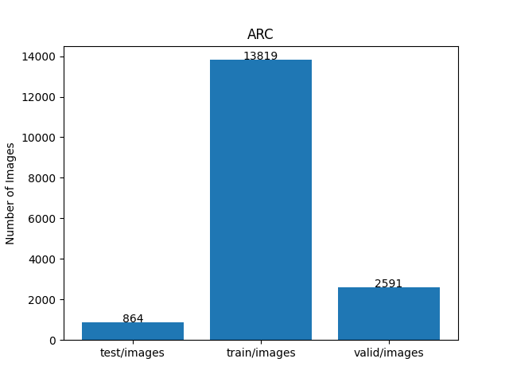 
 
As shown above, the number of images of train and valid datasets is large enough to use for a training set of our segmentation model.
 
 
<h4>2.2 PNG Dataset Generation </h4>
We generated our dataset from NIfTI dataset in neurolabousc github repository 
<a href="https://github.com/neurolabusc/AphasiaRecoveryCohortDemo">
AphasiaRecoveryCohortDemo
</a>
  
<b>Licence:</b> 
<a href="https://github.com/neurolabusc/AphasiaRecoveryCohortDemo?tab=BSD-2-Clause-1-ov-file#readme">BSD-2-Clause license</a>

 
 
We generated our PNG ImageMask Dataset from <b>wbsub-M*_ses-*_T1w.nii.gz</b> and their corresponding 
<b>wsub-M*_ses-*_lesion.nii.gz</b> files.
In the generation process, for simplicity, we excluded all black empty masks and their corresponding images which 
were contained in the original NIfTI files. 
 
<pre>
./NIfTI
 ├─wbsub-M2001_ses-1253x1076_T1w.nii.gz
 ├─wbsub-M2002_ses-1441x1440_T1w.nii.gz
 ├─wbsub-M2004_ses-755x524_T1w.nii.gz
...
 ├─wbsub-M2310_ses-540_T1w.nii.gz

 ├─wsub-M2001_ses-1253x1076_lesion.nii.gz
 ├─wsub-M2002_ses-1441x1440_lesion.nii.gz
 ├─wsub-M2004_ses-755x524_lesion.nii.gz
...
 └─wsub-M2310_ses-540_lesion.nii.gz

</pre>

 
<h4>2.3 PNG Images and Masks </h4>

<b>Train_images_sample</b> 
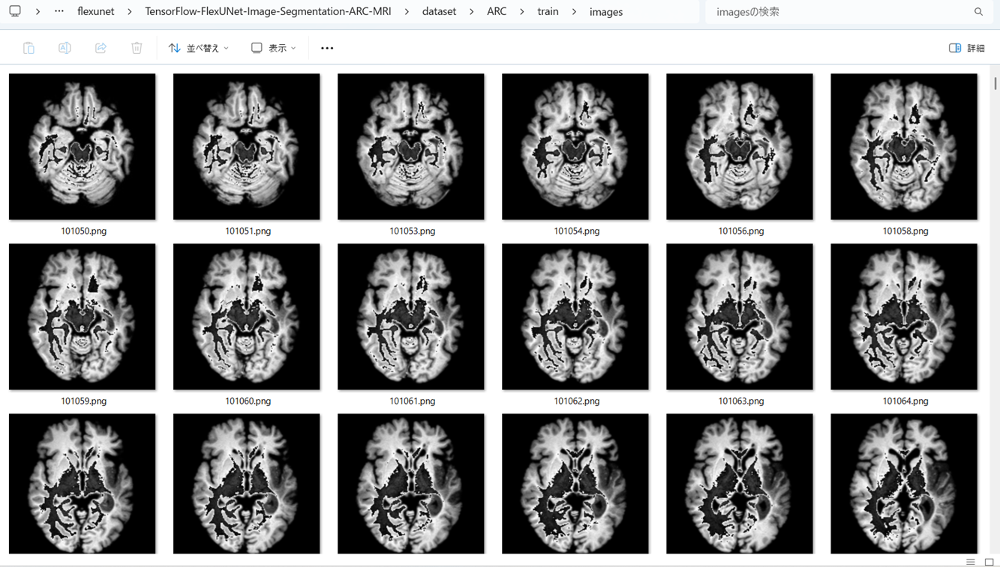
 
<b>Train_masks_sample</b> 
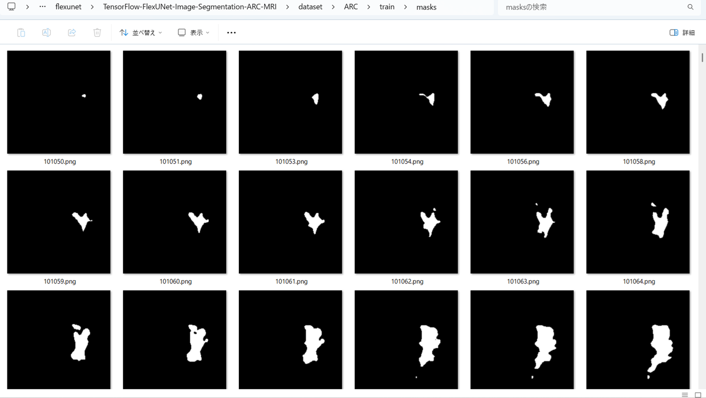
 

<h3>
3 Train TensorFlowUNet Model
</h3>
 We trained ARC TensorFlowFlexUNet Model by using the following
<a href="./projects/TensorFlowFlexUNet/ARC/train_eval_infer.config"> <b>train_eval_infer.config</b></a> file.  
Please move to ./projects/TensorFlowFlexUNet/ARCand run the following bat file. 
<pre>
>1.train.bat
</pre>
, which simply runs the following command. 
<pre>
>python ../../../src/TensorFlowFlexUNetTrainer.py ./train_eval_infer.config
</pre>

<b>Model parameters</b> 
Defined a small base_filters=16 and large base_kernels=(9,9) for the first Conv Layer of Encoder Block of 
<a href="./src/TensorFlowFlexUNet.py">TensorFlowFlexUNet.py</a> 
and a large num_layers (including a bridge between Encoder and Decoder Blocks).
<pre>
[model]
image_width    = 512
image_height   = 512
image_channels = 3

num_classes    = 2

base_filters   = 16
base_kernels   = (9,9)
num_layers     = 8
dropout_rate   = 0.05
dilation       = (1,1)

</pre>

<b>Learning rate</b> 
Defined a small learning rate.  
<pre>
[model]
learning_rate  = 0.00005
</pre>

<b>Online augmentation</b> 
Disabled our online augmentation.  
<pre>
[model]
model         = "TensorFlowFlexUNet"
generator     = False
</pre>

<b>Loss and metrics functions</b> 
Specified "categorical_crossentropy" and <a href="./src/dice_coef_multiclass.py">"dice_coef_multiclass"</a>. 
<pre>
[model]
loss           = "categorical_crossentropy"
metrics        = ["dice_coef_multiclass"]
</pre>
<b>Learning rate reducer callback</b> 
Enabled learning_rate_reducer callback, and a small reducer_patience.
<pre> 
[train]
learning_rate_reducer = True
reducer_factor     = 0.5
reducer_patience   = 4
</pre>

<b>Early stopping callback</b> 
Enabled early stopping callback with patience parameter.
<pre>
[train]
patience      = 10
</pre>

<b>RGB Color map</b> 
rgb color map dict for ARC 1+1 classes.
<pre>
[mask]
mask_datatype    = "categorized"
mask_file_format = ".png"

;ARC rgb color map dict for 2 classes.
;   Background:black, Stroke: white
rgb_map = {(0,0,0):0,(255,255,255):1}

</pre>

<b>Epoch change inference callback</b> 
Enabled <a href="./src/EpochChangeInferencer.py">epoch_change_infer callback (EpochChangeInferencer.py)</a></b>. 
<pre>
[train]
epoch_change_infer       = True
epoch_change_infer_dir   =  "./epoch_change_infer"
num_infer_images         = 6
</pre>

By using this callback, on every epoch_change, the inference procedure can be called
 for 6 images in <b>mini_test</b> folder. This will help you confirm how the predicted mask changes 
 at each epoch during your training process.    

<b>Epoch_change_inference output at starting (epoch 1,2,3)</b> 
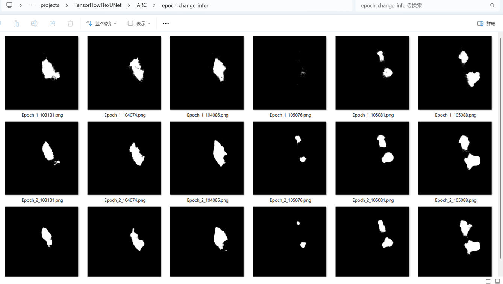 
 
<b>Epoch_change_inference output at middlepoint (epoch 13,14 15)</b> 
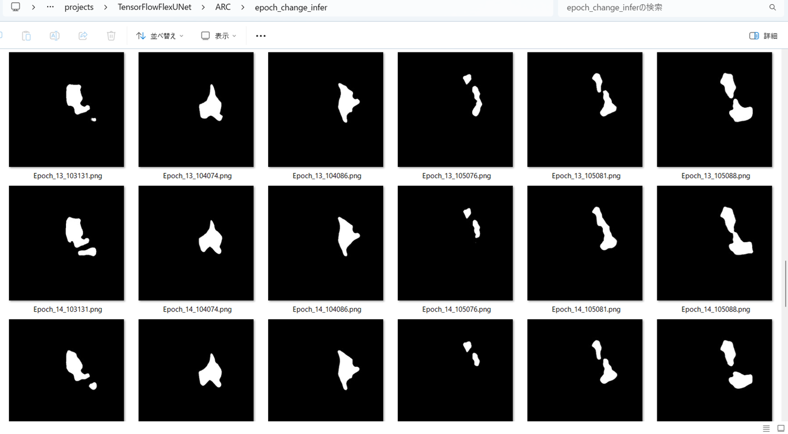 
 

<b>Epoch_change_inference output at ending (epoch 28,29,30)</b> 
 
 

In this experiment, the training process was terminated at epoch 30.  
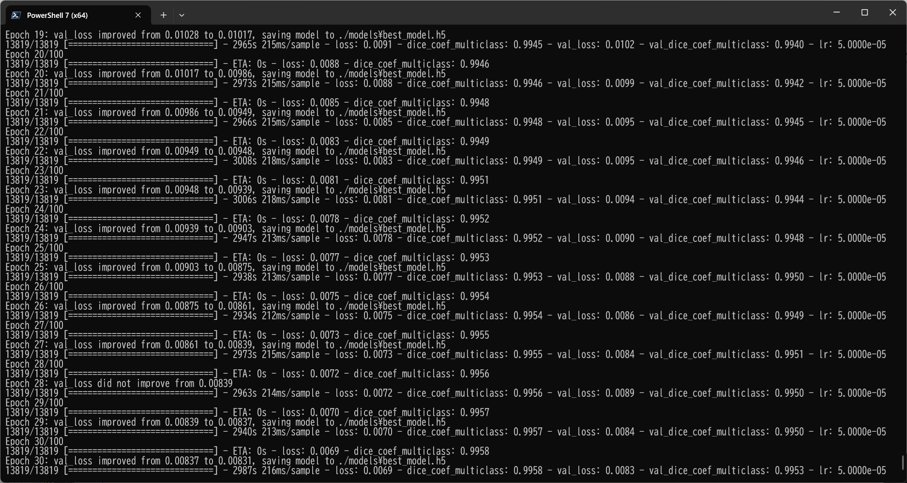 
 

<a href="./projects/TensorFlowFlexUNet/ARC/eval/train_metrics.csv">train_metrics.csv</a> 
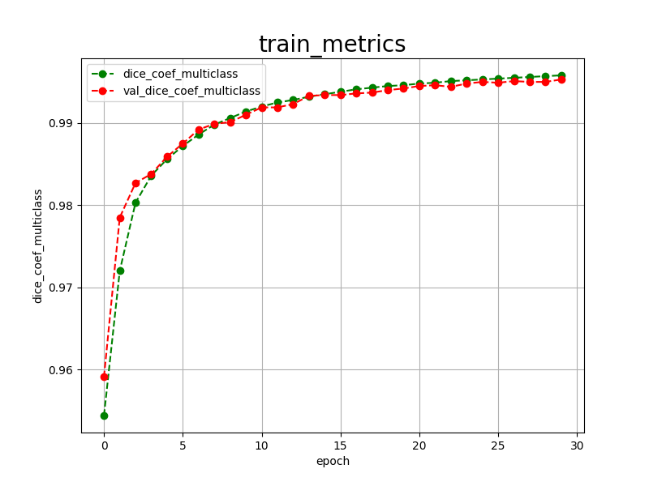 

 
<a href="./projects/TensorFlowFlexUNet/ARC/eval/train_losses.csv">train_losses.csv</a> 
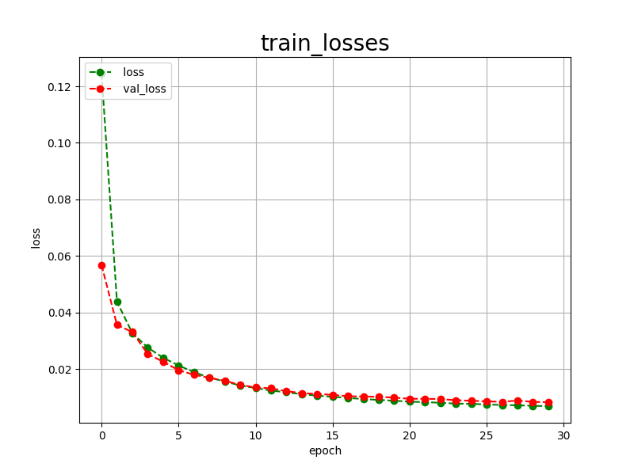 

 

<h3>
4 Evaluation
</h3>
Please move to a <b>./projects/TensorFlowFlexUNet/ARC</b> folder, 
and run the following bat file to evaluate TensorFlowUNet model for ARC. 
<pre>
./2.evaluate.bat
</pre>
This bat file simply runs the following command.
<pre>
python ../../../src/TensorFlowFlexUNetEvaluator.py ./train_eval_infer.config
</pre>

Evaluation console output: 
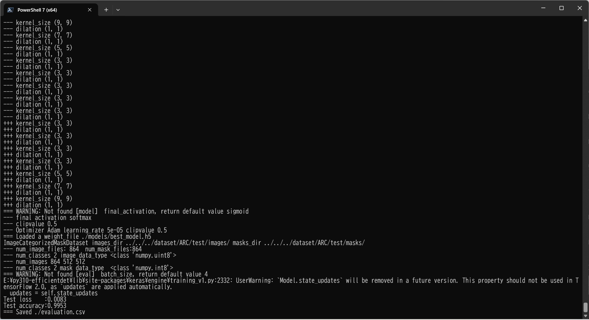
  Image-Segmentation-ARC

<a href="./projects/TensorFlowFlexUNet/ARC/evaluation.csv">evaluation.csv</a> 

The loss (categorical_crossentropy) to this ARC/test was very low, but dice_coef_multiclass very high as shown below.
 
<pre>
categorical_crossentropy,0.0083
dice_coef_multiclass,0.9953

</pre>
 
<h3>
5 Inference
</h3>
Please move to a <b>./projects/TensorFlowFlexUNet/ARC</b> folder 
,and run the following bat file to infer segmentation regions for images by the Trained-TensorFlowUNet model for ARC. 
<pre>
./3.infer.bat
</pre>
This simply runs the following command.
<pre>
python ../../../src/TensorFlowFlexUNetInferencer.py ./train_eval_infer.config
</pre>

<b>mini_test_images</b> 
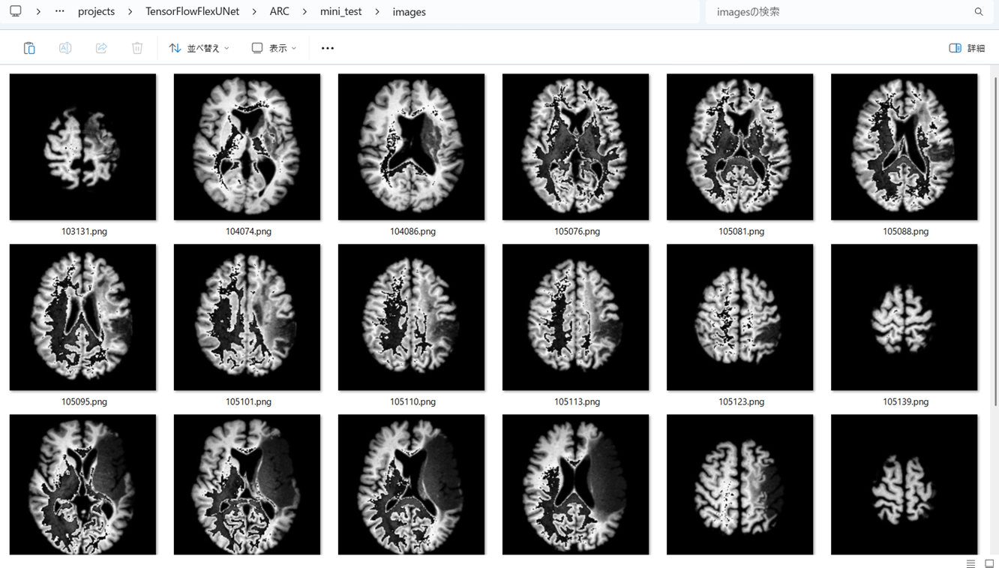 
<b>mini_test_mask(ground_truth)</b> 
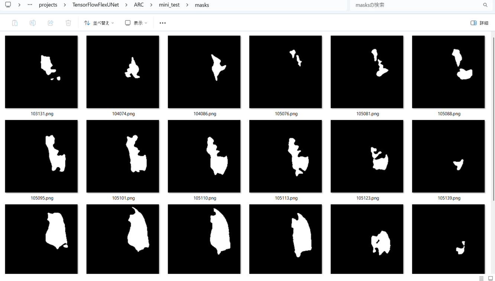 

<b>Inferred test masks</b> 
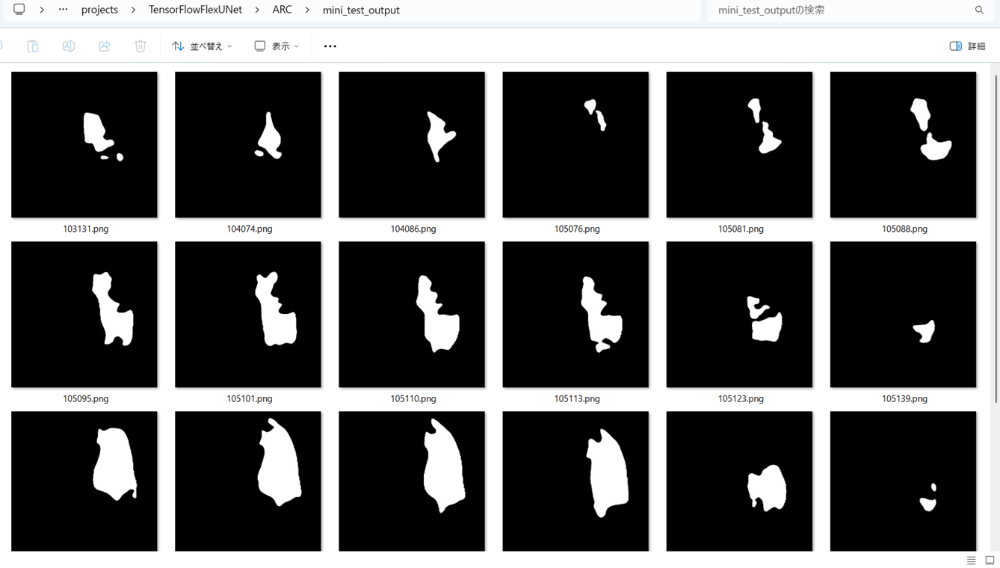 
 

<b>Enlarged images and masks </b> 

<table>
<tr>
<th>Image</th>
<th>Mask (ground_truth)</th>
<th>Inferred-mask</th>
</tr>

<tr>
<td>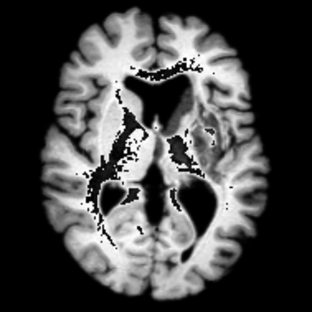</td>
<td>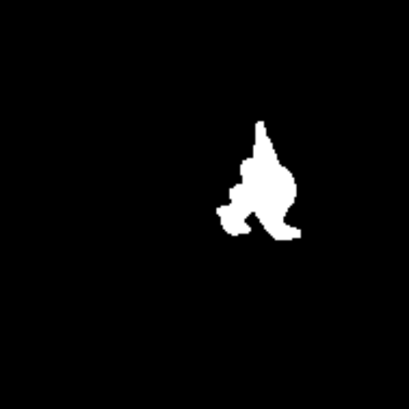</td>
<td>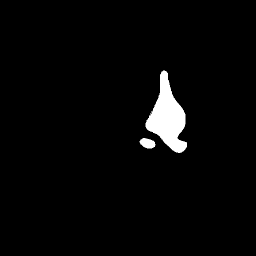</td>
</tr>

<tr>
<td></td>
<td></td>
<td></td>
</tr>

<tr>
<td></td>
<td></td>
<td>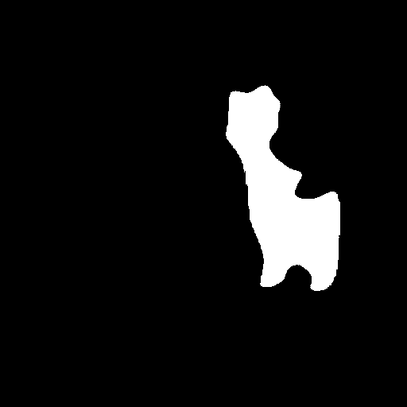</td>
</tr>
<tr>
<td>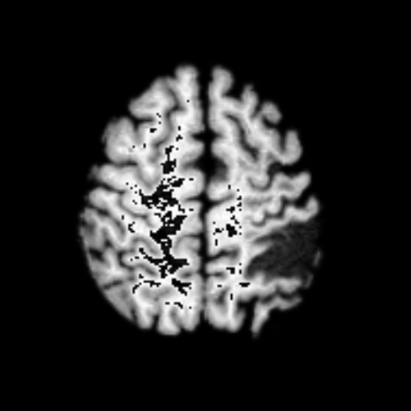</td>
<td></td>
<td>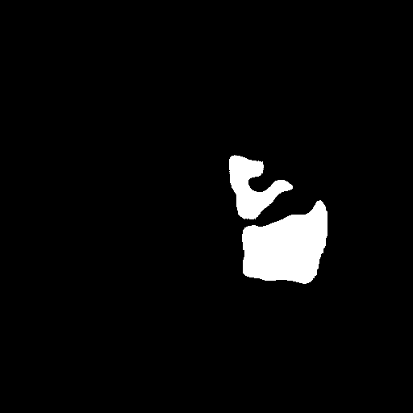</td>
</tr>
<tr>
<td>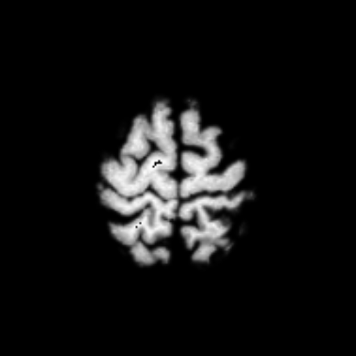</td>
<td></td>
<td></td>
</tr>
<tr>
<td></td>
<td></td>
<td></td>
</tr>

</table>

 

<h3>
References
</h3>
<b>1. Aphasia Recovery Cohort (ARC) Dataset</b> 
Makayla Gibson, Roger Newman-Norlund, Leonardo Bonilha,  
Julius Fridriksson, Gregory Hickok, Argye E. Hillis, Dirk-Bart den Ouden, Chris Rorden 
<a href="https://openneuro.org/datasets/ds004884/versions/1.0.2">
https://openneuro.org/datasets/ds004884/versions/1.0.2
</a>
 
 
<b>2. The Aphasia Recovery Cohort, an open-source chronic stroke repository </b> 
Makayla Gibson, Roger Newman-Norlund, Leonardo Bonilha, Julius Fridriksson,  
Gregory Hickok, Argye E. Hillis, Dirk-Bart den Ouden & Christopher Rorden 

<a href="https://www.nature.com/articles/s41597-024-03819-7">
https://www.nature.com/articles/s41597-024-03819-7
</a>
 
 
<b>3.AphasiaRecoveryCohortDemo</b> 
Chris Rorden, Roger Newman-Norlund 
<a href="https://github.com/neurolabusc/AphasiaRecoveryCohortDemo">
https://github.com/neurolabusc/AphasiaRecoveryCohortDemo</a>

